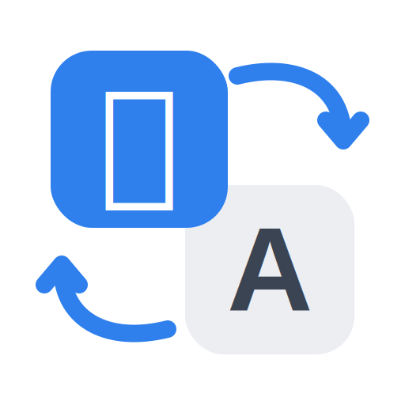
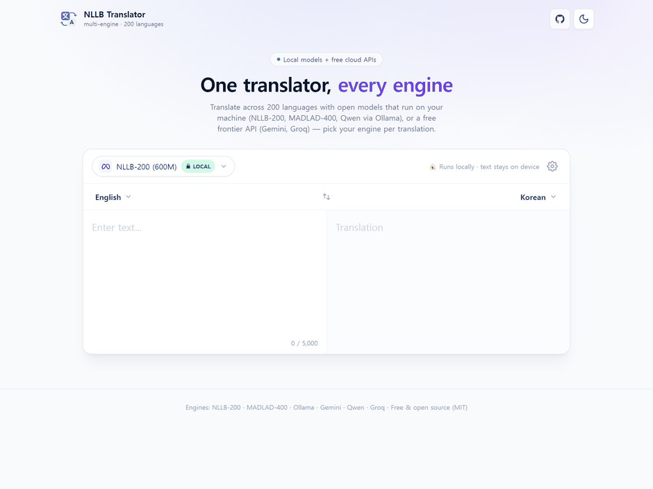

<div align="center">



# NLLB Translator

**A multi-engine neural translator across 200 languages — run an open model locally, or switch to a free frontier API, all from one clean UI.**

[](LICENSE)


</div>

<!-- TODO: replace with a real screenshot / demo GIF -->
<!-- <p align="center"></p> -->

---

Pick your translation **engine per request**: **NLLB-200** running locally (private, offline), Google's **MADLAD-400** for wider coverage, any local LLM via **Ollama** (Qwen, Gemma, TranslateGemma, Aya…), or a free cloud API (**Gemini**, **Groq**) when you want frontier quality without a GPU. A FastAPI backend with a tiny provider registry does the routing; a Next.js + Tailwind frontend gives it a single, cohesive surface.

> This is a v2 rebuild of the original Gradio-based NLLB translator — re-architected into a multi-engine FastAPI + Next.js web app.

## 🔧 Engines

| Engine | Type | Enabled when | Notes |
| --- | --- | --- | --- |
| **NLLB-200 (600M)** | 🖥️ local | model converted | 200 languages · private · offline · light enough for a free CPU host |
| **MADLAD-400 (3B)** | 🖥️ local | model converted | 400+ languages · higher quality than NLLB · needs a beefier host |
| **Ollama** | 🖥️ local | Ollama running | one engine → **Qwen / Gemma / TranslateGemma / Aya / Llama** locally |
| **Gemini 2.5 Flash-Lite** | ☁️ free API | `GEMINI_API_KEY` set | excellent Korean/CJK · no self-hosting |
| **Llama 3.3 70B (Groq)** | ☁️ free API | `GROQ_API_KEY` set | very fast · open LLM |

Every engine **self-reports availability** — the UI only offers the ones that are ready, and each greyed-out engine tells you exactly how to enable it. Adding another is one file (see [below](#-adding-an-engine)).

## ✨ Features

- **Multiple engines, one UI** — a dropdown swaps engines mid-session; local and cloud side by side.
- **200 languages** — the full FLORES-200 set, with a searchable dropdown.
- **Private by default** — NLLB / MADLAD / Ollama run locally; nothing leaves the machine. Cloud engines are clearly labelled.
- **Instant translation** — debounced auto-translate as you type, with language swap, copy, char count, and dark mode.
- **Deploy free** — single-container HuggingFace Space, or split Vercel + backend. See [DEPLOY.md](DEPLOY.md).

## 🏗️ Architecture

```
┌──────────────┐   HTTP / JSON   ┌────────────────────────────────────────┐
│  Next.js UI  │ ──────────────▶ │  FastAPI  ·  /api/*                    │
│  engine +    │ ◀────────────── │  provider registry                     │
│  lang picker │                 │   ├─ nllb    🖥️ CTranslate2 (local)    │
└──────────────┘                 │   ├─ madlad  🖥️ CTranslate2 (local)    │
                                 │   ├─ ollama  🖥️ local LLM               │
                                 │   ├─ gemini  ☁️ free API                │
                                 │   └─ groq    ☁️ free API                │
                                 └────────────────────────────────────────┘
```

```
NLLB-Trans/
├── backend/               FastAPI + provider registry
│   ├── main.py            API: /api/translate, /api/engines, /api/languages
│   ├── providers/         one file per engine (base · nllb · madlad · ollama · gemini · groq)
│   ├── languages.py       full FLORES-200 code ↔ name mapping
│   └── convert_model.py   HF → CTranslate2 int8 conversion
├── frontend/              Next.js (App Router) + Tailwind CSS
│   ├── app/               pages, layout, favicon
│   ├── components/        Translator · EngineSelect · EngineIcon · LanguageSelect · ThemeToggle · Logo
│   └── lib/               API client & types
├── Dockerfile             single-container build (HuggingFace Space)
├── docker-compose.yml     local two-container dev
└── DEPLOY.md              deployment guide
```

## 🚀 Quick start

### Docker Compose (local)

```bash
cp backend/.env.example backend/.env   # optional: add GEMINI_API_KEY / GROQ_API_KEY
docker compose up --build
```

Frontend → <http://localhost:3000>, backend → <http://localhost:8000>. The first build converts the NLLB model (~2.4 GB download, one time).

### Manual (dev)

**Backend**

```bash
cd backend
python -m venv .venv && source .venv/bin/activate     # Windows: .venv\Scripts\activate
pip install -r requirements.txt

# One-time: convert NLLB to CTranslate2 int8. Conversion needs torch
# (runtime inference does not) — install the convert-only deps first:
pip install -r requirements-convert.txt --extra-index-url https://download.pytorch.org/whl/cpu
python convert_model.py

cp .env.example .env          # optional: enable the cloud engines
uvicorn main:app --reload --port 8000
```

**Frontend**

```bash
cd frontend
npm install
cp .env.local.example .env.local     # points at http://localhost:8000
npm run dev
```

Open <http://localhost:3000>. With no model converted and no keys, the app runs but shows "no engine" — convert NLLB **or** set one API key to get going.

## 🔌 Enabling the other engines

```bash
# MADLAD-400 (400+ languages) — one-time convert (~3 GB int8):
HF_MODEL=google/madlad400-3b-mt CT2_MODEL_DIR=models/madlad400-3b-mt-int8 \
  python convert_model.py

# Ollama (Qwen / Gemma / TranslateGemma / Aya / Llama) — install Ollama, then:
ollama pull qwen2.5           # or gemma2, aya, llama3.3, …
export OLLAMA_MODEL=qwen2.5

# Cloud engines — free tiers, no credit card:
#   GEMINI_API_KEY  →  https://aistudio.google.com/apikey
#   GROQ_API_KEY    →  https://console.groq.com/keys
```

## 🧩 API

| Method | Endpoint | Body / Params | Description |
| --- | --- | --- | --- |
| `GET` | `/api/health` | — | Liveness + default engine |
| `GET` | `/api/engines` | — | Engines with `available` flags + setup hints |
| `GET` | `/api/languages` | — | List of `{ code, name }` |
| `POST` | `/api/translate` | `{ text, source, target, engine? }` | Translate; `engine` selects the engine |

Language codes are FLORES-200 (`<iso639-3>_<script>`), e.g. `eng_Latn`, `kor_Hang`, `jpn_Jpan`. Omit `engine` to use the first available one.

```bash
curl -X POST http://localhost:8000/api/translate \
  -H "Content-Type: application/json" \
  -d '{"text":"Hello, world!","source":"eng_Latn","target":"kor_Hang","engine":"nllb"}'
# → {"translation":"안녕하세요, 세계!", ...}
```

### Adding an engine

Create `backend/providers/<name>.py` implementing `TranslationProvider`
(`is_available()` + `translate()`), then add an instance to the list in
[`backend/providers/__init__.py`](backend/providers/__init__.py). It shows up in
the UI automatically when available.

## ☁️ Deploy

- **HuggingFace Space (free, single container)** — the root [`Dockerfile`](Dockerfile) builds the static frontend, the API, and a pre-converted NLLB model into one image served from one origin.
- **Split** — frontend on Vercel + backend on any Docker host.

Full steps, including Space metadata and secrets, in **[DEPLOY.md](DEPLOY.md)**.

## 🛠️ Tech stack

`FastAPI` · `CTranslate2` (int8) · `transformers` · `Next.js 15` · `React 19` · `Tailwind CSS` · `Docker`

Engines: [NLLB-200](https://huggingface.co/facebook/nllb-200-distilled-600M) · [MADLAD-400](https://huggingface.co/google/madlad400-3b-mt) · [Ollama](https://ollama.com) · [Gemini](https://ai.google.dev) · [Groq](https://groq.com)

## 📜 License

MIT — see [LICENSE](LICENSE). Engine weights/services keep their own terms: NLLB is
[CC-BY-NC](https://huggingface.co/facebook/nllb-200-distilled-600M), MADLAD-400 is
[Apache-2.0](https://huggingface.co/google/madlad400-3b-mt); Gemini and Groq are used
via their APIs under their respective terms.
