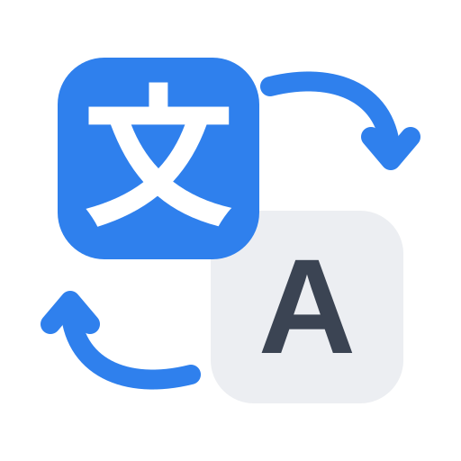
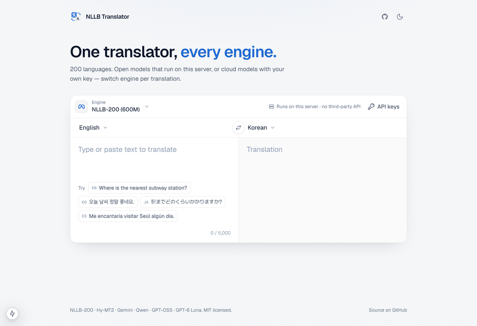

<div align="center">



# NLLB Translator

**A multi-engine translator across 200 languages — open models on your own server, or cloud models with your own key, all from one clean UI.**

[](LICENSE)


</div>

<p align="center">
  <a href="https://huggingface.co/spaces/Asanari/nllb-translator">
    
  </a>
</p>

<p align="center"><b><a href="https://huggingface.co/spaces/Asanari/nllb-translator">▶ Live demo</a></b></p>

---

Pick the translation **engine per request**: **NLLB-200**, Tencent's **Hy-MT2**, and **TranslateGemma 4B** run inside the Space (no third-party API or key needed). TranslateGemma uses a bundled Ollama server. Cloud models — **Gemini**, **Qwen** and **GPT-OSS** on Groq, anything on **OpenRouter**, or OpenAI's low-cost **GPT-6 Luna** — work with your own key. A FastAPI backend with a small provider registry does the routing; a Next.js + Tailwind frontend puts it all on one surface.

> This is a v2 rebuild of the original Gradio-based NLLB translator, re-architected into a multi-engine FastAPI + Next.js web app.

## 🔧 Engines

| Engine | Where it runs | Enabled when | Notes |
| --- | --- | --- | --- |
| **NLLB-200 (600M)** | 🖥️ this server | model converted | Meta · 200 languages · fastest |
| **Hy-MT2 (1.8B)** | 🖥️ this server | GGUF downloaded | Tencent, 2026 · 38 languages incl. Korean · most natural phrasing |
| **TranslateGemma 4B** | 🖥️ this Space (Ollama) | bundled model ready | Google, 2026 · 55 languages · slower on free CPU |
| **Gemini 3.5 Flash-Lite** | ☁️ Google | Gemini key | free tier · strong on Korean / CJK |
| **Qwen 3.8 27B** | ☁️ Groq | Groq key | free tier · strong on CJK |
| **GPT-OSS 120B** | ☁️ Groq | Groq key | free tier · very fast |
| **OpenRouter** | ☁️ OpenRouter | OpenRouter key | any model; free Gemma 4 31B by default |
| **GPT-6 Luna** | ☁️ OpenAI | OpenAI key | paid, $0.10 / $0.50 per 1M tokens |

- **Keys** can live on the server (env vars / Space secrets) or be pasted by each visitor in the app's **API keys** panel. Pasted keys stay in that browser and are passed through per request — the server never stores them.
- **Groq retires models often.** If a configured Groq model disappears, the backend looks up Groq's live catalogue and switches to the newest model of the same family.
- Every engine **reports its own availability**; the UI only offers the ready ones and tells you how to enable the rest. Adding another engine is one file (see [below](#adding-an-engine)).

## ✨ Features

- **Multiple engines, one UI** — switch engines mid-session; local and cloud side by side, grouped.
- **200 languages** — the full FLORES-200 set, with a searchable picker and common languages pinned.
- **No third-party API for local engines** — NLLB and Hy-MT2 translate on the server; cloud engines are labelled with where the text goes.
- **Built for typing** — debounced auto-translate, auto-growing panes, one-click example phrases, skeleton loading, swap, copy, dark mode.
- **Keyboard and screen-reader friendly** — arrow keys / Enter / Esc in every picker, labelled controls, live-region output, correct `lang` / `dir` on text.
- **Deploy free** — single-container HuggingFace Space, or split Vercel + backend. See [DEPLOY.md](DEPLOY.md).

## 🏗️ Architecture

```
┌──────────────┐   HTTP / JSON   ┌───────────────────────────────────────────┐
│  Next.js UI  │ ──────────────▶ │  FastAPI  ·  /api/*                       │
│  engine +    │ ◀────────────── │  provider registry                        │
│  lang picker │  (+ user keys)  │   ├─ nllb         🖥️ CTranslate2 int8     │
└──────────────┘                 │   ├─ hymt         🖥️ llama.cpp (GGUF)     │
                                 │   ├─ ollama       🖥️ TranslateGemma      │
                                 │   ├─ gemini       ☁️ Google               │
                                 │   ├─ groq_qwen    ☁️ Groq                 │
                                 │   ├─ groq_gptoss  ☁️ Groq                 │
                                 │   ├─ openrouter   ☁️ OpenRouter           │
                                 │   └─ openai       ☁️ OpenAI               │
                                 └───────────────────────────────────────────┘
```

```
NLLB-Trans/
├── backend/                 FastAPI + provider registry
│   ├── main.py              API: /api/translate, /api/engines, /api/languages
│   ├── providers/           one file per engine + shared chat client
│   ├── languages.py         FLORES-200 code ↔ name mapping
│   ├── convert_model.py     NLLB: HF → CTranslate2 int8
│   ├── fetch_hymt.py        Hy-MT2: download the official GGUF
│   ├── ollama_service.py    Space: prepare Ollama model and supervise services
│   └── requirements-llm.txt llama.cpp bindings for Hy-MT2 (optional)
├── frontend/                Next.js (App Router) + Tailwind CSS
│   ├── app/                 page, layout, favicon
│   ├── components/          Translator · EngineSelect · LanguageSelect · Settings · …
│   └── lib/                 API client, key storage, engine metadata
├── Dockerfile               single-container build (HuggingFace Space)
├── docker-compose.yml       local two-container dev
└── DEPLOY.md                deployment guide
```

## 🚀 Quick start

### Docker Compose (local)

```bash
cp backend/.env.example backend/.env   # optional: add API keys
docker compose up --build
```

Frontend → <http://localhost:3000>, backend → <http://localhost:8000>. The first build downloads and prepares the local models (NLLB ~2.4 GB, Hy-MT2 ~1.1 GB, one time).

### Manual (dev)

**Backend**

```bash
cd backend
python -m venv .venv && source .venv/bin/activate     # Windows: .venv\Scripts\activate
pip install -r requirements.txt

# NLLB-200 — one-time conversion to CTranslate2 int8 (conversion needs torch;
# runtime inference does not):
pip install -r requirements-convert.txt --extra-index-url https://download.pytorch.org/whl/cpu
python convert_model.py

# Hy-MT2 (optional) — prebuilt llama.cpp CPU wheel + the official GGUF:
pip install -r requirements-llm.txt --extra-index-url https://abetlen.github.io/llama-cpp-python/whl/cpu --only-binary=llama-cpp-python
python fetch_hymt.py

cp .env.example .env          # optional: server-side API keys
uvicorn main:app --reload --port 8000
```

**Frontend**

```bash
cd frontend
npm install
cp .env.local.example .env.local     # points at http://localhost:8000
npm run dev
```

Open <http://localhost:3000>. With no local model and no keys the app still runs and shows how to enable each engine.

## 🔌 Enabling the other engines

```bash
# TranslateGemma is bundled in the Space. For manual dev or a separate Ollama:
ollama pull translategemma:4b          # any other model works too:
export OLLAMA_MODEL=translategemma:4b  # OLLAMA_MODEL=qwen3 etc.

# Cloud engines — paste keys in the app, or set them server-side:
#   GEMINI_API_KEY      https://aistudio.google.com/apikey   (free tier)
#   GROQ_API_KEY        https://console.groq.com/keys        (free tier)
#   OPENROUTER_API_KEY  https://openrouter.ai/keys           (free + paid models)
#   OPENAI_API_KEY      https://platform.openai.com/api-keys (paid, low cost)
```

## 🧩 API

| Method | Endpoint | Body / Params | Description |
| --- | --- | --- | --- |
| `GET` | `/api/health` | — | Liveness + default engine |
| `GET` | `/api/engines` | — | Engines with `available` flags + setup hints |
| `GET` | `/api/languages` | — | List of `{ code, name }` |
| `POST` | `/api/translate` | `{ text, source, target, engine? }` | Translate; `engine` selects the engine |

Language codes are FLORES-200 (`<iso639-3>_<script>`), e.g. `eng_Latn`, `kor_Hang`, `jpn_Jpan`. Omit `engine` to use the first available one. Cloud engines accept a per-request key in `X-Gemini-Key`, `X-Groq-Key`, `X-OpenRouter-Key` (plus `X-OpenRouter-Model`) or `X-OpenAI-Key`.

```bash
curl -X POST http://localhost:8000/api/translate \
  -H "Content-Type: application/json" \
  -d '{"text":"The weather is lovely today.","source":"eng_Latn","target":"kor_Hang","engine":"hymt"}'
# → {"translation":"오늘 날씨가 아주 좋네요.", ...}
```

### Adding an engine

Create `backend/providers/<name>.py` implementing `TranslationProvider`
(`is_available()` + `translate()`), then add an instance to the list in
[`backend/providers/__init__.py`](backend/providers/__init__.py). OpenAI-compatible
chat APIs can reuse `providers/chat_api.py`. The engine shows up in the UI
automatically once it's available.

## ☁️ Deploy

- **HuggingFace Space (single container)** — the root [`Dockerfile`](Dockerfile) builds the static frontend, the API, and all three local models into one image served from one origin. Ollama stays internal to the container, processes one request at a time, and unloads TranslateGemma after two idle minutes.
- **Split** — frontend on Vercel + backend on any Docker host.

Full steps, including Space metadata and secrets, in **[DEPLOY.md](DEPLOY.md)**.

## 🛠️ Tech stack

`FastAPI` · `CTranslate2` (int8) · `llama.cpp` · `transformers` · `Next.js 15` · `React 19` · `Tailwind CSS` · `Docker`

Engines: [NLLB-200](https://huggingface.co/facebook/nllb-200-distilled-600M) · [Hy-MT2](https://huggingface.co/tencent/Hy-MT2-1.8B) · [TranslateGemma](https://ollama.com/library/translategemma) · [Gemini](https://ai.google.dev) · [Groq](https://groq.com) · [OpenRouter](https://openrouter.ai) · [OpenAI](https://platform.openai.com)

## 📜 License

MIT — see [LICENSE](LICENSE). Model weights and services keep their own terms:
NLLB-200 is [CC-BY-NC 4.0](https://huggingface.co/facebook/nllb-200-distilled-600M),
Hy-MT2 is [Apache-2.0](https://huggingface.co/tencent/Hy-MT2-1.8B), TranslateGemma
follows the Gemma Terms of Use, and the cloud engines are used through their
providers' APIs under their respective terms.
